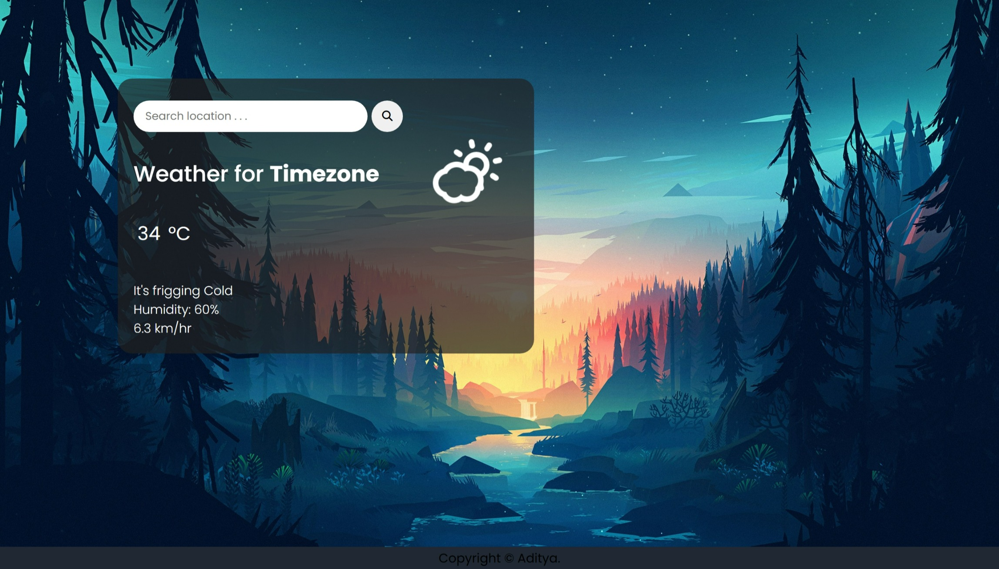
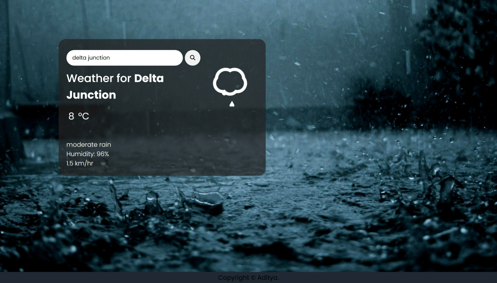

<div align="center">
<h3 align="center">Live weather site</h3>
      
      
      
  <br />

  <!-- <div>
    
  </div> -->
</div>

## 📋 <a name="table">Table of Contents</a>

1. 🤖 [Introduction](#introduction)
2. ⚙️ [Tech Stack](#tech-stack)
3. 🔋 [Features](#features)
4. 🤸 [Quick Start](#quick-start)
5. 🕸️ [Snippets](#snippets)

## <a name="introduction">🤖 Introduction</a>

Welcome to My Weather Website, your go-to destination for accurate weather forecasts!

## <a name="tech-stack">⚙️ Tech Stack</a>

- HTML
- CSS
- JavaScript


## <a name="features">🔋 Features</a>

👉 **Live Weather Updates**: Get real-time weather updates for your current location.

👉 **Search Functionality**: Easily search for weather forecasts of any location worldwide.

👉 **Responsive Design**: Enjoy a seamless experience across all devices.

## <a name="quick-start">🤸 Quick Start</a>

Follow these steps to set up the project locally on your machine.

**Prerequisites**

Make sure you have the following installed on your machine:

- [Git](https://git-scm.com/) # optional
- [Node.js](https://nodejs.org/en)

**Cloning the Repository**

```bash
git clone https://github.com/Aditya10403/HavenlyHomes.git
cd portfolio
```

**Running the Project**

- run with `liveserver` 

- or Open [http://127.0.0.1:5501/](http://127.0.0.1:5501/) in your browser to view the project.

**How to Use**

👉 **Live Weather Updates**:
   - Visit the homepage to see the current weather of your location.
   - Allow location access if prompted to enable automatic detection.

👉 **Search Functionality**:
   - Use the search bar to find weather forecasts for specific locations.
   - Get accurate weather information anywhere in the world.

👉 **Customizable Units**:
   - Click on temperature to swap units according to your preference.
   - Choose between Celsius and Fahrenheit for temperature.

## <a name="snippets">🕸️ Snippets</a>

<details>
<summary><code>assets</code></summary>

[link](/photos/)

</details>


## <a>🚨 Disclaimer</a>

The weather data provided on this website is sourced from reputable sources, but accuracy cannot be guaranteed. Always refer to official weather services for critical weather-related decisions.

#

